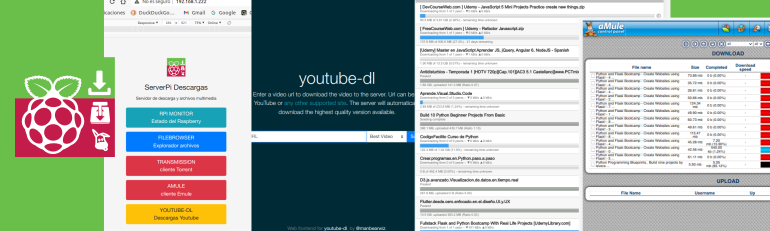

# Rapsberry Pi server download 

#### Raspberry pi docker, transmision, amule, youtube-dl, filebrowser...

Usar la rapsberry como equipo para tener un amule, un transmitions que es un cliente Torrent, para poder descargar archivos al tratarse de un equipo de bajo consumo y no hay problema en dejarlos encendido continuamente.

Le ponemos también el servicio de youtube-dl que nos permite descargar videos de Youtube y si lo necesitamos convertirlos a mp3.

Le he instalado un servidor samba y un servidor dlna para compartir los archivos por la red. También he incorporado el servicio de filebrowser para tener acceso a los archivos a traves de un navegador web.

he creado un index para que sirva de lanzador de todas aplicaciones

Todo montado sobre docker con lo que ponerlo en marcha es cuestión de 2 minutos.,.

Partimos de una rapsberry con un sistema Raspberry Pi OS Lite instalado, habilitado el ssh y con ip fija en 192.168.1.222, y instalado docker y docker-compose en ella.

* dejo pendiente hacer un tutorial de esta primera fase si alguien lo necesita

# Previo

Necesitamos montar un disco duro sobre la raspberry para tener una capacidad de almacenaje

## Montar discos externos para almacenamiento

Tengo un disco duro formateado a ext4

PASO 1. Conocer la denominación de la partición que queremos montar

    sudo  fdisk -l

PASO 2. Conocer el punto de montaje y tipo de la unidad que vamos a montar

    ls -l /dev/disk/by-uuid

PASO 3. Crear la carpeta donde se montará nuestra partición

    sudo mkdir /media/disco

PASO 4. Configurar que cada que arranquemos el sistema se monte la unidad

Para decirle a nuestro sistema que monte la unidad debemos configurar el archivo /etc/fstab.

    sudo nano /etc/fstab

Montar unidad ext4

    UUID=XXXXXXXXXXXX /media/disco ext4 errors=remount-ro 0 1

cambiar permiso unidad al usuario pi

    chown pi:pi /media/disco

reiniciamos

    sudo reboot

crear mis directorios

    mkdir -p /media/disco/download/youtube-dl
    mkdir -p /media/disco/download/amule
    mkdir -p /media/disco/download/torrent

    mkdir -p /media/disco/media/musica

# clonar el repositorio y ejecutar el compose

git clone Rpi_server_download

cd Rpi_server_download

docker-compose up -d

para acceder a las aplicaciones hay montado un contenedor con nginx donde hay una web que no da acceso a las aplicaciones:

abrir en navegador y colocar la ip de nuestra raspberry, en mi caso:

    http://192.168.1.222

## contenedores montandos

### Docker samba

Servidor samba, compartir los archivos por la red con otros dispositivos. 

    smb://192.168.1.222

https://github.com/dperson/samba

### Docker rpi-monitor

Sistema de motorización de los recurso de nuestra raspberry, capacidad, temperatura ...

https://github.com/michaelmiklis/docker-rpi-monitor

### Docker minidlna

En mi caso tengo una television LG que tiene una entrada de red y utiliza un sistema llamado DLNA, con esto puedo ver los archivos descargados en la tele.

https://github.com/vladgh/docker_base_images/tree/master/minidlna

###  Docker transmision

Cliente torrent para descargar archivos

    us: 1234
    ps: 1234

https://gitlab.com/jaymoulin/docker-transmission

###  Docker amule

Cliente de redes P2P tipo Emule, para descargar archivos

    ps: 1234

###  Docker filebrowser

Navegador de archivos web no permite navegar y gestionar los archivos guardados en nuestro servidor

    us: 1234
    ps: 1234